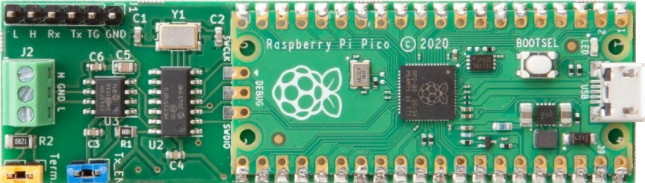

# :car: EMP2 - TouchEmulator

## Disclaimer :warning:
- The shown content is just done for learning and educational purposes on private ground
- You should not modify anything in your vehicle nor influence the CAN-Bus, especially not if you are using your vehicle on public roads or areas
- You are fully responsible for your actions ***and noone else***
- If you have questions/problems with your vehicle, please contact your dealer
- All shown informations are gathered by ...
  - ... trial and error search electrical wiring for CAN-Buses
  - ... sniffing CAN and reverse engineer CAN behaviour when e.g. StSt function is toggled

## Description

Automation of user-inputs as if the touch-display was used, by sending messages on vehicle CAN-Bus from a rapid prototyping device.

Main goal:
- Toggle Start-Stop Button after each vehicle start automatically to OFF

## Vehicles

### Development
The shown content (Pins, Colors, Positions, IDs, ...) are detemined from a Toyota Proace City, thats why you have to expect deviations to other models

### Compatibility
The below described device to emulate user inputs via CAN-Bus could/should work for all vehicles built on the [EMP2 Platform](https://en.wikipedia.org/wiki/PSA_EMP2_platform).

### Examples
- Toyota Proace (City) (Used for development)
- Citroen Berlingo
- Peugeot Partner/Rifter
- Vauxhall/Opel Combo
- Fiat Doblo
- ...

## Used CAN-Bus interface

### CAN-Bus name
- CAN INFO DIV

### Used connector
Central BSI-Unit, located at drivers footrest on top of fuse box.
Yellow Connector as shown below:

### Configuration

Baudrate:  `125 kBaud`

| Pin | Description | Wire Color |
| --- | --- | --- |
| `34` | CAN INFO DIV High | Brown |
| `36` | CAN INFO DIV Low | Blue |

## Functions

### Turn OFF StartStop

| Message ID | Byte | Bit |
| --- | --- | --- |
| `0x1A9` | `6` | `7` |

#### Message example

- ON/OFF = `0x00 0x00 0x00 0x00 0x00 0x00 0x50 0x00`
- TOGGLE = `0x00 0x00 0x00 0x00 0x00 0x00 0xD0 0x00`

### Activate Android Auto

Seems not to be controlled via ***CAN INFO DIV***

### Deactivate Lane Assistant

Seems not to be controlled via ***CAN INFO DIV***

## Solution

### Devices

- [CANPico Board](https://www.raspberrypi.com/products/raspberry-pi-pico/)
- [Firmware](https://github.com/kentindell/canhack/tree/master/pico/micropython)

### Wiring

- ***CANPico*** CAN High and Low connected to the corresponding Pins in the vehicle
- ***PiPico*** micro-USB supply connected to the USB charging-port, placed in the rear-compartment (This one is ON and OFF, corresponding to the vehicle ignition)
- ***Termination Resistor Jumper*** has to be taken OFF the board, to not add additional resistors to the already running vehicle-network

### Code
- [main.py](main.py) written in pyton
- Just open the code and download it to the PiPico with [Thonny](https://thonny.org/)

### Target behavior example

Just an example and may not always be up to date with the current python-script, so please have a look at the current scripts for detailled functionality.

1. Vehicle turned ON
2. Raspberry Pi boots and waits e.g. 20s
3. Message 1A9 is sent
4. Raspberry Pi goes to Standby (e.g. blinking LED)
