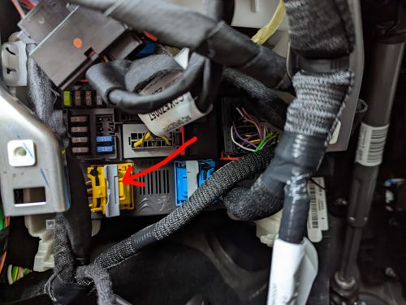

# :car: EMP2 - TouchEmulator

## Disclaimer :warning:
- The shown content is just done for learning and educational purposes on private ground
- You should not modify anything in your vehicle nor influence the CAN-Bus, especially not if you are using your vehicle on public roads or areas
- You (and noone else) are fully responsible for your actions
- If you have questions/problems with your vehicle, please contact your dealer
- All shown informations are gathered by ...
  - ... trial and error search electrical wiring for CAN-Buses
  - ... sniffing CAN and reverse engineer CAN behaviour when e.g. StSt function is toggled
- The shown content (Pins, Colors, Positions, IDs, ...) are detemined from a Toyota Proace City, thats why you have to expect deviations to other models

## Description

Automation of user-inputs as if the touch-display was used.

For example:

- Toggle Start-Stop Button
- Activate Android Auto
- ...

## Vehicles

### Compatibility
The below described device to use the vehicle CAN-Bus to emulate user inputs could/should work for all vehicles built on the [EMP2 Platform](https://en.wikipedia.org/wiki/PSA_EMP2_platform)

### Examples
- Toyota Proace (City) (Used for development)
- Citroen Berlingo
- Peugeot Partner/Rifter
- Vauxhall/Opel Combo
- Fiat Doblo
- ...

## Used interface

### Name
- CAN INFO DIV

### Connector
Central BSI-Unit, located at drivers footrest on top of fuse box.
Yellow Connector as shown below:

### Pins/Wires
| Pin # | Description | Wire Color |
| --- | --- | --- |
| tbd | Ground | tbd |
| 29 | 5V USB Supply | ?Green? |
| 34 | CAN INFO DIV High | Brown |
| 36 | CAN INFO DIV Low | Blue |

### Baudrate
- 125 kBaud

### Toggle StartStop
- Message ID: 0x1A9
- Byte: 6
- Bit: 7

#### Example
- ON/OFF = 0x00 0x00 0x00 0x00 0x00 0x00 **0x50** 0x00
- TOGGLE = 0x00 0x00 0x00 0x00 0x00 0x00 **0xD0** 0x00

### Activate Android Auto
- Message ID: tbd
- Byte: tbd
- Bit: tbd

## Solution

### Used devices
- [Raspberry Pi Pico](https://www.raspberrypi.com/products/raspberry-pi-pico/) with MicroPython installed
- [Waveshare Pico-CAN-A](https://www.waveshare.com/wiki/Pico-CAN-A) Raspberry Pi Pico Hat

### Wiring

#### Waveshare Pico-CAN-A

- CAN High/Low connected to Pins "CAN INFO DIV High", "CAN INFO DIV Low"  mentioned above

#### Raspberry Pi Pico

- 5V Supply via custom MicroUSB cable from Pins "5V Supply" and "Ground" mentioned above

### Code
- [main.py](main.py) written in python
- If some functions shall be deactivated, the corresponding line of code can be out-commented

### Code behavior overview

Just an example and may not always be up to date with the current python-script
1. Raspberry Pi boots (LED permanently ON)
2. Sleep 10s
3. Read Message 1A9 from CAN
4. Set Bit 7 in Byte 6
5. Send modified Message 1A9 (Should toggle current StSt-State)
6. Raspberry Pi standby until 5V supply is interrupted (LED blinking)
